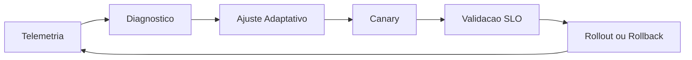

# Roadmap de Tuning Adaptativo Avancado

Este diretorio documenta um plano dedicado para tuning adaptativo de deteccao no Frigate headless, com foco em precisao, latencia e estabilidade sob variacao de carga e ambiente.

## Objetivo
Padronizar e automatizar ajustes operacionais de deteccao com base em sinais reais de telemetria, reduzindo ruido e mantendo throughput sustentavel.

## Fases
- `phase-00-operational-baseline-and-segmentation.md`
- `phase-01-dynamic-day-night-profiles.md`
- `phase-02-adaptive-threshold-and-cooldown.md`
- `phase-03-adaptive-frame-skip-and-load-shedding.md`
- `phase-04-smart-region-policy-and-roi-scheduling.md`
- `phase-05-priority-routing-and-worker-affinity.md`
- `phase-06-canary-for-config-and-automatic-rollback.md`
- `phase-07-noise-intelligence-and-auto-suggestions.md`
- `phase-08-closed-loop-optimization-engine.md`
- `phase-09-governance-audit-and-continuous-recalibration.md`

## Diagrama - trilha adaptativa ponta a ponta

## Sequencia de execucao
Eu vou executar as fases na ordem, com gate de evidencias por fase antes de promover para o proximo passo.
