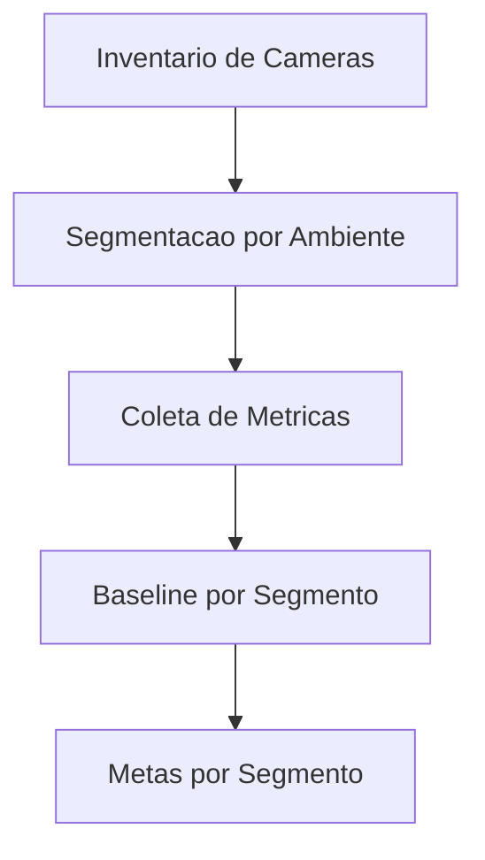

# Fase 00 - Baseline Operacional e Segmentacao

## Objetivo da fase
Nesta fase eu separo o parque de cameras por perfil operacional para evitar tuning unico em cenarios diferentes.

## O que eu vou alterar
- Classificar cameras por ambiente (`indoor`, `outdoor`, `baixa_luz`, `alto_movimento`).
- Capturar baseline por segmento: latencia, drop, falso positivo e backlog.
- Definir limites por segmento para tuning adaptativo.
- Criar score inicial de saude por camera.

## Diagrama - segmentacao e baseline

## Criterios de aceite
- Todas as cameras classificadas em segmentos.
- Baseline publicado por segmento com evidencias.
- Limites de operacao definidos por perfil.

## Proximos passos
Eu ativo perfis dinamicos dia/noite na Fase 01.

## Implementacao aplicada
- Segmentacao de camera por ambiente em `POST /v1/adaptive/segments/classify`.
- Captura de baseline por segmento com metricas de processo/fila/drop em `POST /v1/adaptive/segments/baseline/capture`.
- Limites operacionais por segmento em `POST /v1/adaptive/segments/limits`.
- Score inicial de saude por camera derivado de baseline segmentado.
