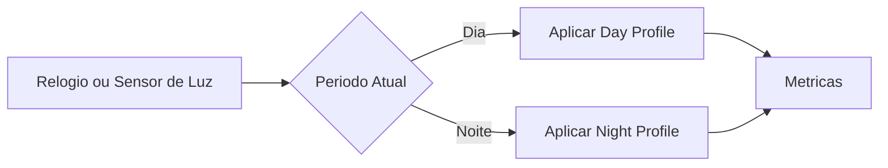

# Fase 01 - Perfis Dinamicos Dia e Noite

## Objetivo da fase
Nesta fase eu aplico perfis de deteccao distintos por periodo para reduzir falso positivo em variacao de iluminacao.

## O que eu vou alterar
- Criar presets por camera para `day_profile` e `night_profile`.
- Ajustar `min_confidence`, `motion_threshold` e `min_area` por perfil.
- Definir troca automatica por horario e opcional por sensor de luminosidade.
- Registrar mudanca de perfil com auditoria.

## Diagrama - troca automatica de perfil

## Criterios de aceite
- Comutacao sem interrupcao do pipeline.
- Queda de falso positivo em baixa luz.
- Sem regressao relevante de falso negativo.

## Proximos passos
Eu aplico thresholds e cooldown adaptativos na Fase 02.
