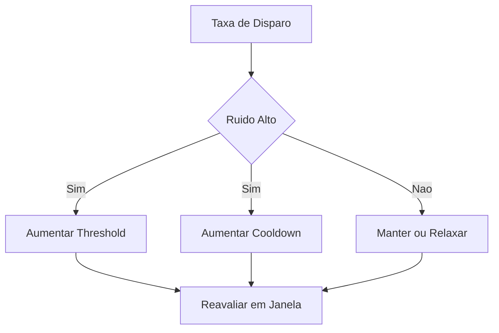

# Fase 02 - Threshold e Cooldown Adaptativos

## Objetivo da fase
Nesta fase eu torno regras de disparo adaptativas para controlar ruido sem perder eventos criticos.

## O que eu vou alterar
- Ajustar `min_confidence` de forma adaptativa por regra.
- Aplicar cooldown dinamico conforme taxa de repeticao.
- Separar politica para classes criticas e informativas.
- Definir limite maximo e minimo para ajustes automaticos.

## Diagrama - controle adaptativo de regra

## Criterios de aceite
- Reducao de eventos duplicados e spam.
- Preservacao de deteccao em cenarios criticos.
- Ajustes sempre dentro de limites aprovados.

## Proximos passos
Eu implemento frame skip adaptativo e shedding na Fase 03.
