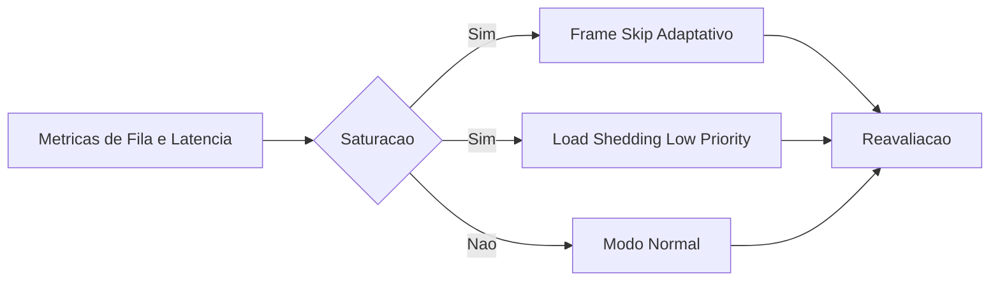

# Fase 03 - Frame Skip Adaptativo e Load Shedding

## Objetivo da fase
Nesta fase eu protejo latencia do pipeline durante picos sem colapso global.

## O que eu vou alterar
- Ajustar frame skip conforme `queue_depth` e `inference_latency`.
- Priorizar classes e cameras criticas em saturacao.
- Aplicar shedding controlado em eventos de baixa prioridade.
- Restaurar modo normal automaticamente apos estabilizacao.

## Implementacao aplicada
- Novo bloco de configuracao por camera em `detect.adaptive_load_shedding`.
- Controle adaptativo no loop de `process_frames` em `frigate/video.py`.
- Priorizacao por `critical_labels` durante saturacao.
- Shedding de eventos low-priority quando `shed_non_critical_events=true`.
- Recuperacao gradual para modo normal baseada em ciclos estaveis.
- Metricas de observabilidade:
  - `adaptive_overload`
  - `adaptive_skip_frames`
  - `adaptive_inference_latency_ms`

## Exemplo de configuracao
```yaml
cameras:
  front:
    detect:
      adaptive_load_shedding:
        enabled: true
        queue_high_watermark: 1
        queue_recovery_watermark: 0
        inference_latency_high_ms: 120
        inference_latency_recovery_ms: 80
        min_skip_frames: 0
        max_skip_frames: 4
        recovery_stable_cycles: 12
        critical_labels: [person, car]
        shed_non_critical_events: true
```

## Diagrama - resposta a saturacao


## Criterios de aceite
- Fila deixa de crescer indefinidamente em pico.
- Eventos criticos mantem latencia dentro de meta.
- Recuperacao automatica apos burst.

## Proximos passos
Eu evoluo politica de regioes e ROI por agenda na Fase 04.
