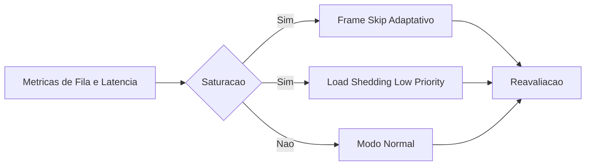

# Fase 03 - Frame Skip Adaptativo e Load Shedding

## Objetivo da fase
Nesta fase eu protejo latencia do pipeline durante picos sem colapso global.

## O que eu vou alterar
- Ajustar frame skip conforme `queue_depth` e `inference_latency`.
- Priorizar classes e cameras criticas em saturacao.
- Aplicar shedding controlado em eventos de baixa prioridade.
- Restaurar modo normal automaticamente apos estabilizacao.

## Diagrama - resposta a saturacao

## Criterios de aceite
- Fila deixa de crescer indefinidamente em pico.
- Eventos criticos mantem latencia dentro de meta.
- Recuperacao automatica apos burst.

## Proximos passos
Eu evoluo politica de regioes e ROI por agenda na Fase 04.
