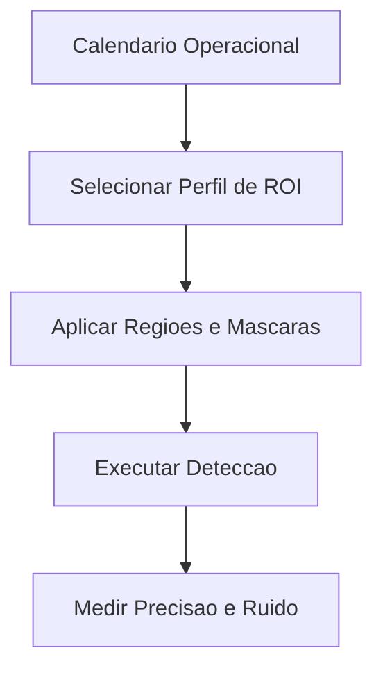

# Fase 04 - Politica Inteligente de Regioes e Agenda de ROI

## Objetivo da fase
Nesta fase eu torno demarcacoes de regiao dinamicas por contexto para melhorar precisao operacional.

## O que eu vou alterar
- Definir perfis de ROI por horario e dia da semana.
- Aplicar mascaras dinamicas para fontes de ruido recorrente.
- Ajustar modo de regiao (`inside`, `crossing`, `enter_exit`) por periodo.
- Versionar mudancas de geometria e politica de regiao.

## Implementacao aplicada
- Novo bloco de configuracao em `detect.roi_scheduling`.
- Perfis com agenda por dia/hora e versao (`version`) para rastreabilidade.
- Mascaras dinamicas por perfil para suprimir regioes de ruido recorrente.
- Multiplicador de tamanho de regiao por perfil (`region_size_multiplier`).
- Override de modo de zona por periodo (`zone_modes`) com suporte a:
  - `inside`
  - `crossing`
  - `enter_exit`
- Metricas adicionadas:
  - `roi_profile_active`
  - `roi_profile_version`

## Exemplo de configuracao
```yaml
cameras:
  front:
    detect:
      roi_scheduling:
        enabled: true
        profiles:
          - name: night-noise-control
            version: 2
            days_of_week: [0, 1, 2, 3, 4, 5, 6]
            start_time: "21:00"
            end_time: "05:30"
            region_size_multiplier: 0.9
            dynamic_masks:
              - coordinates: "0.0,0.0,0.4,0.0,0.4,0.4,0.0,0.4"
            zone_modes:
              driveway: crossing
              gate: enter_exit
```

## Diagrama - agenda de ROI


## Criterios de aceite
- Reducao de ruido em horarios conhecidos.
- Melhor acerto em zonas criticas.
- Mudancas rastreaveis por versao.

## Proximos passos
Eu otimizo roteamento por prioridade e afinidade na Fase 05.
