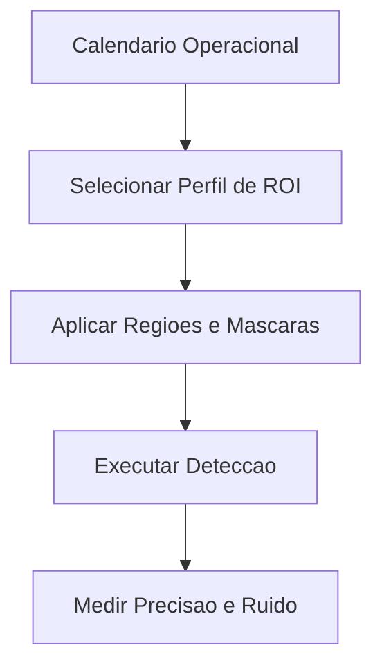

# Fase 04 - Politica Inteligente de Regioes e Agenda de ROI

## Objetivo da fase
Nesta fase eu torno demarcacoes de regiao dinamicas por contexto para melhorar precisao operacional.

## O que eu vou alterar
- Definir perfis de ROI por horario e dia da semana.
- Aplicar mascaras dinamicas para fontes de ruido recorrente.
- Ajustar modo de regiao (`inside`, `crossing`, `enter_exit`) por periodo.
- Versionar mudancas de geometria e politica de regiao.

## Diagrama - agenda de ROI

## Criterios de aceite
- Reducao de ruido em horarios conhecidos.
- Melhor acerto em zonas criticas.
- Mudancas rastreaveis por versao.

## Proximos passos
Eu otimizo roteamento por prioridade e afinidade na Fase 05.
