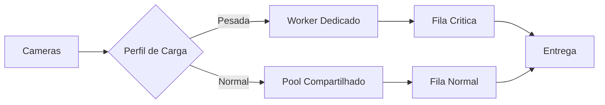

# Fase 05 - Roteamento por Prioridade e Afinidade de Worker

## Objetivo da fase
Nesta fase eu isolo cargas pesadas para reduzir interferencia entre cameras e aumentar previsibilidade.

## O que eu vou alterar
- Definir afinidade de cameras pesadas em workers dedicados.
- Separar roteamento por prioridade de evento.
- Aplicar quotas por tenant para evitar efeito domino.
- Ajustar concorrencia por shard conforme perfil real.

## Diagrama - afinidade e roteamento

## Criterios de aceite
- Menor variancia de latencia entre cameras.
- Reducao de interferencia cruzada.
- Estabilidade maior em carga sustentada.

## Proximos passos
Eu habilito canario de configuracao com rollback automatico na Fase 06.
