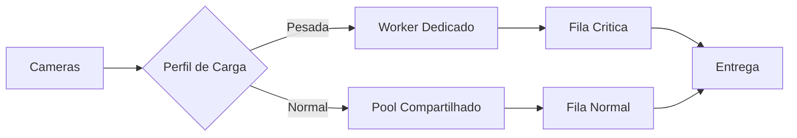

# Fase 05 - Roteamento por Prioridade e Afinidade de Worker

## Objetivo da fase
Nesta fase eu isolo cargas pesadas para reduzir interferencia entre cameras e aumentar previsibilidade.

## O que eu vou alterar
- Definir afinidade de cameras pesadas em workers dedicados.
- Separar roteamento por prioridade de evento.
- Aplicar quotas por tenant para evitar efeito domino.
- Ajustar concorrencia por shard conforme perfil real.

## Implementacao aplicada
- Roteamento de inferencia em duas filas:
  - `high-priority`
  - `normal`
- Politica por camera em `detect.priority_routing` com:
  - `high_priority`
  - `tenant_key`
  - `worker_affinity_key`
  - `max_normal_queue_depth` (quota/degradacao)
- Afinidade de worker por detector via campos extras:
  - `priority_lane` (`high`, `normal`, `balanced`)
  - `camera_affinity_keys` (lista de chaves de afinidade)
- Quota para evitar efeito domino:
  - shedding de requests low-priority quando fila normal excede limite da camera.
- Metricas adicionadas:
  - `routing_high_priority`
  - `routing_quota_drops`
  - `routing_affinity_active`

## Exemplo de configuracao
```yaml
detectors:
  cpu:
    type: cpu
    priority_lane: high
    camera_affinity_keys: [gpu-a]

cameras:
  front:
    detect:
      priority_routing:
        enabled: true
        high_priority: true
        tenant_key: tenant-a
        worker_affinity_key: gpu-a
        max_normal_queue_depth: 24
```

## Diagrama - afinidade e roteamento


## Criterios de aceite
- Menor variancia de latencia entre cameras.
- Reducao de interferencia cruzada.
- Estabilidade maior em carga sustentada.

## Proximos passos
Eu habilito canario de configuracao com rollback automatico na Fase 06.
