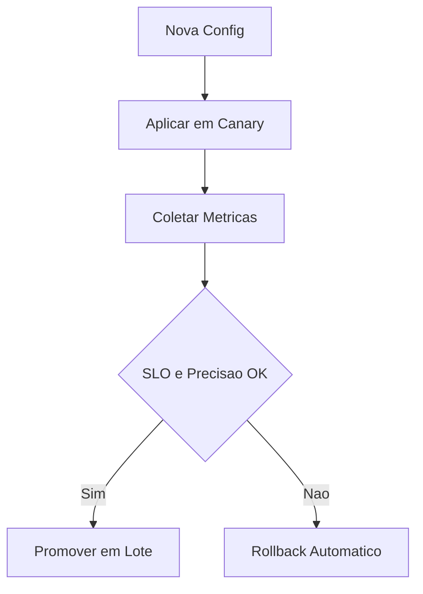

# Fase 06 - Canary de Configuracao e Rollback Automatico

## Objetivo da fase
Nesta fase eu diminuo risco de tuning agressivo usando rollout progressivo por camera e tenant.

## O que eu vou alterar
- Aplicar mudancas primeiro em subset canario.
- Medir impacto em janelas curtas e medias.
- Promover automaticamente se metas forem cumpridas.
- Acionar rollback automatico em caso de degradacao.

## Diagrama - rollout canario

## Criterios de aceite
- Nenhuma regressao ampla por configuracao ruim.
- Rollback automatico funcional e rapido.
- Evidencias de promocao/rollback armazenadas.

## Proximos passos
Eu adiciono inteligencia de ruido e sugestao automatica na Fase 07.
