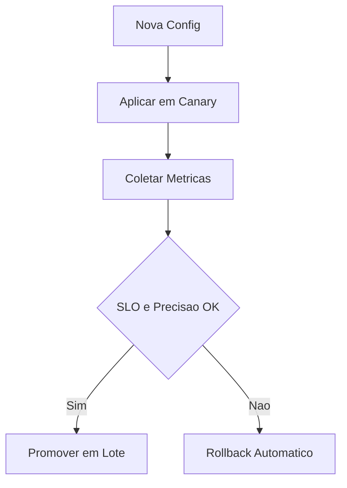

# Fase 06 - Canary de Configuracao e Rollback Automatico

## Objetivo da fase
Nesta fase eu diminuo risco de tuning agressivo usando rollout progressivo por camera e tenant.

## O que eu vou alterar
- Aplicar mudancas primeiro em subset canario.
- Medir impacto em janelas curtas e medias.
- Promover automaticamente se metas forem cumpridas.
- Acionar rollback automatico em caso de degradacao.

## Implementacao aplicada
- Suporte a rollout canario no endpoint `POST /v1/config/apply` com parametros:
  - `canary`
  - `canary_cameras`
  - `canary_duration_sec`
  - `canary_max_skipped_fps_increase`
  - `canary_min_process_fps_ratio`
  - `canary_max_inference_latency_increase_pct`
- Aplicacao canario em subset de cameras (patch camera-scoped).
- Janela de avaliacao automatica por metricas por camera:
  - `process_fps`
  - `skipped_fps`
  - `adaptive_inference_latency_ms`
- Promocao automatica ao fim da janela quando SLO estiver saudavel.
- Rollback automatico em degradacao e rollback manual via endpoint.
- Endpoints de operacao:
  - `GET /v1/config/canary/status`
  - `POST /v1/config/canary/rollback`
- `GET /v1/status` agora inclui estado de canary.

## Exemplo de canary apply
```json
{
  "tenant_id": "tenant-a",
  "canary": true,
  "canary_cameras": ["front", "garage"],
  "canary_duration_sec": 300,
  "canary_max_skipped_fps_increase": 2.0,
  "canary_min_process_fps_ratio": 0.7,
  "canary_max_inference_latency_increase_pct": 35.0,
  "config": {
    "cameras": {
      "front": {
        "detect": {
          "adaptive_load_shedding": {
            "max_skip_frames": 3
          }
        }
      }
    }
  }
}
```

## Diagrama - rollout canario


## Criterios de aceite
- Nenhuma regressao ampla por configuracao ruim.
- Rollback automatico funcional e rapido.
- Evidencias de promocao/rollback armazenadas.

## Proximos passos
Eu adiciono inteligencia de ruido e sugestao automatica na Fase 07.
