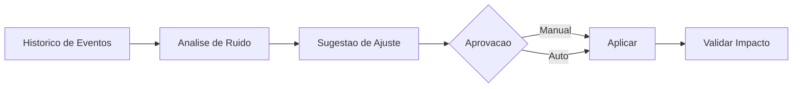

# Fase 07 - Inteligencia de Ruido e Sugestoes Automaticas

## Objetivo da fase
Nesta fase eu transformo historico operacional em recomendacoes de tuning para reduzir trabalho manual.

## O que eu vou alterar
- Detectar regras com maior taxa de ruido por camera/regiao.
- Gerar sugestoes de ajuste (`threshold`, `cooldown`, ROI, mascara).
- Exibir impacto estimado antes de aplicar.
- Permitir aprovacao manual ou auto-aprovacao restrita.

## Diagrama - ciclo de sugestao

## Criterios de aceite
- Sugestoes com ganho mensuravel em ambiente piloto.
- Sem aumento relevante de falso negativo.
- Trilha de auditoria para cada sugestao aplicada.

## Proximos passos
Eu fecho o loop adaptativo completo na Fase 08.
