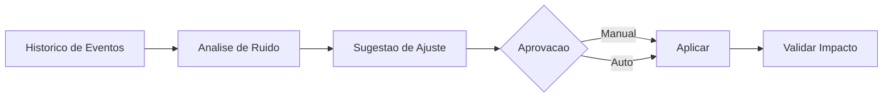

# Fase 07 - Inteligencia de Ruido e Sugestoes Automaticas

## Objetivo da fase
Nesta fase eu transformo historico operacional em recomendacoes de tuning para reduzir trabalho manual.

## O que eu vou alterar
- Detectar regras com maior taxa de ruido por camera/regiao.
- Gerar sugestoes de ajuste (`threshold`, `cooldown`, ROI, mascara).
- Exibir impacto estimado antes de aplicar.
- Permitir aprovacao manual ou auto-aprovacao restrita.

## Implementacao aplicada
- Motor de sugestoes em `frigate/headless/noise_intelligence.py`.
- Deteccao de ruido por camera usando sinais operacionais:
  - `skipped_fps`
  - `adaptive_overload`
  - `routing_quota_drops`
- Tipos de sugestao gerados:
  - ajuste de `threshold`
  - ajuste de `cooldown`
  - ativacao de perfil baseline de ROI
  - recomendacao de mascara dinamica (manual)
- Cada sugestao inclui `estimated_impact` antes de aplicar.
- Fluxo de aprovacao:
  - manual para qualquer risco
  - auto-aprovacao restrita a `risk=low`
- Trilha de auditoria para sugestoes aplicadas.

## Endpoints adicionados
- `GET /v1/noise/suggestions`
- `POST /v1/noise/suggestions/{suggestion_id}/approve`
- `GET /v1/noise/audit`

## Diagrama - ciclo de sugestao

## Criterios de aceite
- Sugestoes com ganho mensuravel em ambiente piloto.
- Sem aumento relevante de falso negativo.
- Trilha de auditoria para cada sugestao aplicada.

## Proximos passos
Eu fecho o loop adaptativo completo na Fase 08.
