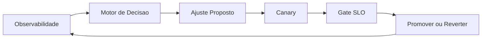

# Fase 08 - Motor de Otimizacao em Loop Fechado

## Objetivo da fase
Nesta fase eu conecto observabilidade, regra adaptativa e rollout em um ciclo continuo controlado.

## O que eu vou alterar
- Consolidar motor de decisao baseado em politicas.
- Definir janela de observacao e frequencia de ajuste.
- Aplicar limites de seguranca para evitar oscilacao.
- Congelar alteracoes automaticas em incidentes maiores.

## Diagrama - loop fechado

## Criterios de aceite
- Ciclo automatico estavel sem flapping.
- Ganho sustentado de latencia e precisao.
- Controles de seguranca impedindo degradacao em cascata.

## Proximos passos
Eu formalizo governanca, auditoria e recalibracao continua na Fase 09.
