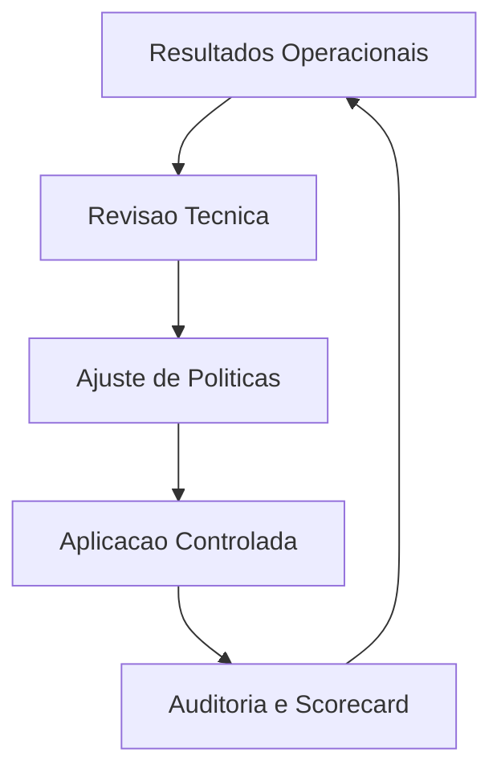

# Fase 09 - Governanca, Auditoria e Recalibracao Continua

## Objetivo da fase
Nesta fase eu institucionalizo o tuning adaptativo como pratica continua e auditavel.

## O que eu vou alterar
- Definir comite tecnico para revisar politicas adaptativas.
- Padronizar auditoria de mudancas automaticas e manuais.
- Criar calendario de recalibracao por segmento de camera.
- Publicar scorecard mensal de desempenho e precisao.

## Implementacao aplicada
- Camada de governanca em `frigate/headless/governance.py`.
- Politica versionada e ownership com suporte a:
  - `policy_version`
  - `owner`
  - `approval_mode`
  - `technical_committee`
- Auditoria padronizada (manual + automatica) para:
  - `config_apply`
  - aprovacao de sugestoes de ruido
  - canary rollback/promocao
  - decisoes de loop fechado
- Calendario de recalibracao por segmento de camera (API de schedule).
- Scorecard mensal via API com indicadores de:
  - `avg_process_fps`
  - `avg_skipped_fps`
  - contagem de mudancas manuais/automaticas
  - promocoes e rollbacks.

## Endpoints adicionados
- `GET /v1/governance/policy`
- `POST /v1/governance/policy`
- `GET /v1/governance/audit`
- `GET /v1/governance/recalibration/schedule`
- `POST /v1/governance/recalibration/schedule`
- `GET /v1/governance/scorecard`

## Diagrama - governanca continua

## Criterios de aceite
- Processo de revisao ativo com ownership claro.
- Rastreabilidade completa de mudancas de tuning.
- Recalibracao periodica reduzindo drift de performance.

## Proximos passos
Eu inicio novo ciclo de melhoria com baseline renovado.
