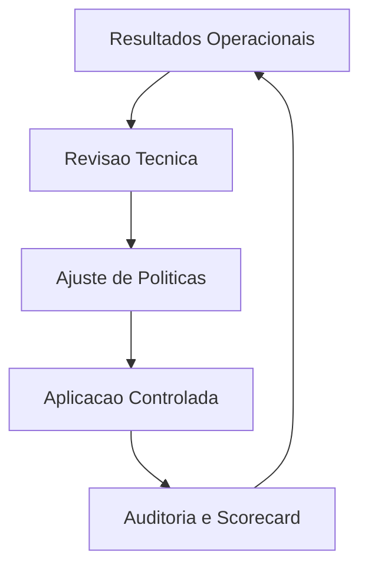

# Fase 09 - Governanca, Auditoria e Recalibracao Continua

## Objetivo da fase
Nesta fase eu institucionalizo o tuning adaptativo como pratica continua e auditavel.

## O que eu vou alterar
- Definir comite tecnico para revisar politicas adaptativas.
- Padronizar auditoria de mudancas automaticas e manuais.
- Criar calendario de recalibracao por segmento de camera.
- Publicar scorecard mensal de desempenho e precisao.

## Diagrama - governanca continua

## Criterios de aceite
- Processo de revisao ativo com ownership claro.
- Rastreabilidade completa de mudancas de tuning.
- Recalibracao periodica reduzindo drift de performance.

## Proximos passos
Eu inicio novo ciclo de melhoria com baseline renovado.
