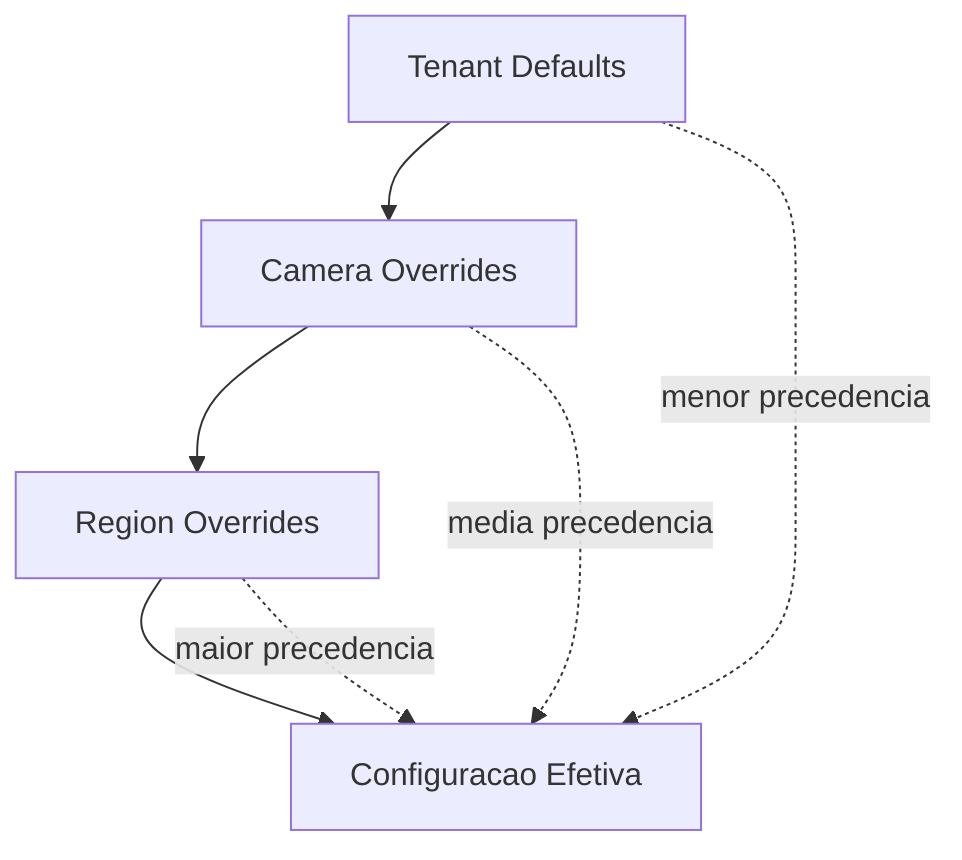
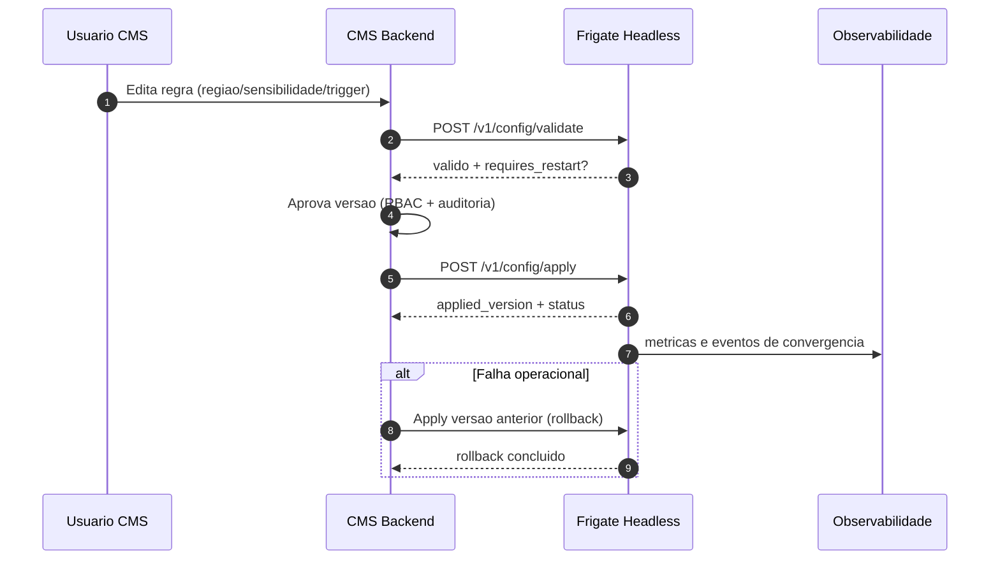

# Fase 15 - Controle de Eventos do Frigate e Configuracao Operacional

## Objetivo da fase
Nesta fase eu documento o contrato funcional para o CMS controlar configuracoes de eventos do Frigate por tenant, camera e regiao, incluindo sensibilidade, filtros e automacoes.

## Escopo de controle do CMS sobre o Frigate
- Demarcacao de regioes por camera.
- Sensibilidade de deteccao por contexto (global/camera/regiao).
- Regras de disparo por tipo de evento.
- Acoes por evento (webhook, fila, automacao interna).
- Janela de ativacao (horario, dia da semana, perfil).
- Versionamento, auditoria e rollback de configuracao.

## Diagrama - arquitetura de controle (CMS -> Frigate)
```mermaid
flowchart LR
    A[CMS Control Plane] -->|/v1/config/validate| B[Frigate API Headless]
    A -->|/v1/config/apply| B
    A -->|/v1/cameras/{camera_id}/regions/upsert| B
    A -->|/v1/triggers/upsert| B
    B --> C[Runtime Config Store]
    C --> D[Detector/Tracker Pipeline]
    D --> E[Eventos]
    E --> F[SSE / Webhook / Queue]
```

## Modelo de configuracao (hierarquia)
1. `tenant defaults` (padrao geral do tenant)
2. `camera overrides` (ajuste por camera)
3. `region overrides` (ajuste fino por regiao)

Regra de precedencia:
- Regra mais especifica vence (`region > camera > tenant`).
- Em empate, vence a versao mais recente aprovada.

## Diagrama - hierarquia e precedencia de configuracao


## Funcionalidades base por evento
### 1) Evento de deteccao de objeto
- Controles base:
  - classes permitidas (`person`, `car`, `dog`, etc.)
  - `min_confidence`
  - `min_area`/`max_area`
  - cooldown por classe
- Objetivo: reduzir falso positivo e ruido por cenario.

### 2) Evento de movimento
- Controles base:
  - sensibilidade (`motion_threshold`)
  - area minima de movimento
  - mascaras de exclusao
  - janela ativa por horario
- Objetivo: ajustar resposta em ambientes com variacao luminosa.

### 3) Evento de entrada/saida de regiao
- Controles base:
  - modo da regiao (`inside`, `crossing`, `enter_exit`)
  - direcao opcional
  - persistencia minima (tempo em regiao)
- Objetivo: monitorar perimetro e fluxo em zonas criticas.

### 4) Evento de permanencia (loitering)
- Controles base:
  - tempo minimo de permanencia
  - classes monitoradas
  - horario de aplicacao
- Objetivo: detectar comportamento suspeito em zona sensivel.

### 5) Evento composto (regra de correlacao)
- Controles base:
  - condicoes combinadas (ex.: pessoa + regiao + horario)
  - janela temporal da correlacao
  - prioridade de notificacao
- Objetivo: aumentar assertividade para acionar automacao.

## Entidades de controle no CMS
- `FrigateCameraProfile`
  - perfil operacional por camera (fps detect, preset, nivel de ruido)
- `FrigateRegion`
  - geometria (`polygon`, `bbox`, `mask`) e metadados
- `FrigateEventRule`
  - regra de disparo com filtros, thresholds e prioridade
- `FrigateTriggerAction`
  - destino da acao (webhook, fila, callback interno)
- `FrigateConfigVersion`
  - versao desejada/aplicada com status de convergencia

## Operacoes base de controle
- Upsert de regiao por camera.
- Listagem e remocao de regiao.
- Upsert, listagem e remocao de trigger de evento.
- Validacao de configuracao antes de aplicar.
- Apply de configuracao com retorno `requires_restart` quando aplicavel.
- Consulta de configuracao efetiva por tenant/camera.

## Mapeamento com capacidades headless existentes
- Regioes:
  - `POST /v1/cameras/{camera_id}/regions/upsert`
  - `GET /v1/cameras/{camera_id}/regions`
  - `DELETE /v1/cameras/{camera_id}/regions/{region_id}`
- Triggers/eventos:
  - `POST /v1/triggers/upsert`
  - `GET /v1/triggers`
  - `DELETE /v1/triggers/{id}`
- Runtime config:
  - `POST /v1/config/validate`
  - `POST /v1/config/apply`
  - `GET /v1/config/effective`

## Politica de sensibilidade e tuning
- Presets operacionais:
  - `conservador` (menos alertas, mais precisao)
  - `balanceado` (equilibrio)
  - `agressivo` (mais cobertura, mais ruido)
- O CMS deve permitir override por camera e por regiao.
- Toda mudanca de sensibilidade deve registrar motivo e autor.

## Governanca de mudanca
- Fluxo recomendado:
  1. editar configuracao no CMS
  2. validar (`/v1/config/validate`)
  3. aprovar (RBAC: editor -> admin)
  4. aplicar (`/v1/config/apply`)
  5. monitorar convergencia (`desired_version` vs `applied_version`)
- Rollback:
  - voltar para ultima versao estavel aprovada por tenant/camera.

## Diagrama - fluxo de mudanca, aplicacao e rollback


## Observabilidade minima por evento
- Taxa de disparo por regra.
- Taxa de falso positivo estimada por classe/regiao.
- Latencia entre deteccao e entrega de acao.
- Falhas de entrega por destino de trigger.
- Top regras com maior ruido operacional.

## Criterios de aceite
- CMS consegue controlar regiao, sensibilidade e triggers por tenant.
- Validacao bloqueia configuracao invalida antes de aplicacao.
- Aplicacao de config e auditavel com autoria, horario e diff.
- Existe rollback funcional para versao anterior sem perda de rastreabilidade.

## Impacto no sistema
O CMS passa a ser o plano de controle real das regras de evento do Frigate, com governanca, consistencia e operacao segura em escala.

## Limitacoes atuais
Acoes avancadas de trigger podem depender de extensoes adicionais no runtime para cobertura completa de casos enterprise.

## Proximos passos
Eu detalho contratos JSON de payload por regra/tipo de evento e adiciono suite de testes de contrato ponta a ponta entre CMS e Frigate.
