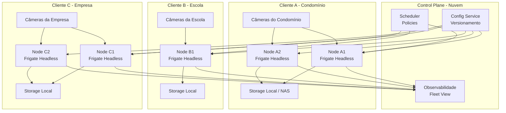
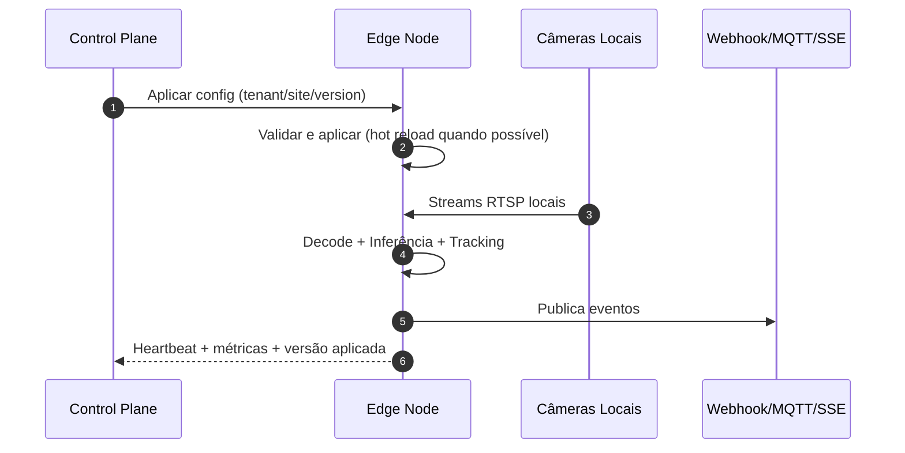

# Arquitetura Edge-First - Capacidade por Nó, Requisitos de Hardware e Cenários Reais

## 1. Objetivo do documento
Este documento descreve a arquitetura horizontal do Frigate em modelo **edge-first**, no qual cada cliente (condomínio, escola, empresa, campus, etc.) roda o processamento localmente no seu próprio ambiente.

A proposta foca em:
- ilustrar o que é um nó no contexto de implantação local;
- explicar o fluxo operacional entre controle em nuvem e execução no edge;
- apresentar requisitos mínimos de hardware por família;
- estimar capacidade de câmeras por nó com faixas realistas;
- orientar planejamento de escala por tipo de cliente.

---

## 2. Premissas de arquitetura edge-first

### 2.1 Princípio
O processamento de vídeo fica no local do cliente (edge), reduzindo latência e dependência de uplink para nuvem.

### 2.2 Papel da nuvem
A nuvem atua como **control-plane**:
- versionamento de configuração;
- distribuição de políticas;
- observabilidade agregada;
- rollout/canary/rollback;
- auditoria.

### 2.3 Papel do local (cliente)
O local atua como **data-plane**:
- ingestão de streams de câmeras;
- decode, detecção e tracking;
- geração de eventos;
- retenção local conforme política;
- API local para health, status e config aplicada.

---

## 3. O que é um nó no modelo edge-first
Um **nó** é um servidor/host local do cliente dedicado ao runtime do Frigate headless.

Pode ser:
- 1 servidor físico no rack do condomínio;
- 1 workstation/servidor em escola;
- 1 VM dedicada em infraestrutura local virtualizada.

Cada nó possui recursos de:
- CPU (decode, preprocessamento, tracking, API);
- GPU/TPU/NPU (inferência);
- RAM/SHM (buffers de frame);
- disco (segmentos/eventos/retention);
- rede (ingest RTSP e saída de eventos).

---

## 4. Ilustração da topologia edge-first por cliente

---

## 5. Fluxo operacional (nuvem -> edge -> eventos)

---

## 6. Capacidade: o que mais pesa por nó

### 6.1 Decode de vídeo
Normalmente é o primeiro gargalo quando:
- streams estão em alta resolução/bitrate;
- não há aceleração de decode ativa;
- há muitas câmeras por nó.

### 6.2 Inferência
Depende diretamente do acelerador (GPU/TPU) e do modelo.

### 6.3 SHM/RAM
Buffers insuficientes provocam perda de frame e latência.

### 6.4 Disco
Gravação contínua e retenção longa pressionam IOPS e throughput.

### 6.5 Rede local
Rede saturada (especialmente uplinks de switches) afeta ingestão.

---

## 7. Requisitos mínimos por perfil de implantação

## 7.1 Perfil mínimo viável (edge pequeno)
Indicado para:
- residência ampliada, pequeno comércio, escola pequena
- até ~20 câmeras em configuração conservadora

Recomendado:
- CPU: 8 cores/16 threads (ou equivalente)
- RAM: 32 GB
- SHM: >= 2-4 GB (ajustado ao número/resolução)
- Disco: SSD NVMe (mín. 1 TB, ideal 2 TB+)
- Rede: 1 Gbps local estável
- Aceleração: GPU de entrada ou TPU dedicada

Faixa típica de capacidade:
- **15 a 30 câmeras por nó** (5 FPS detecção, substream)

## 7.2 Perfil médio (condomínio/escola média)
Recomendado:
- CPU: 12-16 cores / 24-32 threads
- RAM: 64 GB
- SHM: 4-8 GB
- Disco: NVMe + storage secundário para retenção
- Rede: 1/2.5 Gbps
- GPU: classe média dedicada para inferência

Faixa típica:
- **30 a 70 câmeras por nó**

## 7.3 Perfil alto (empresa/campus)
Recomendado:
- CPU: 24+ cores (server-grade)
- RAM: 128 GB
- SHM: 8-16 GB
- Disco: NVMe alto desempenho + storage dedicado
- Rede: 10 Gbps no core/local backbone
- GPU: classe datacenter/workstation robusta

Faixa típica:
- **70 a 150+ câmeras por nó**

---

## 8. Exemplos por família de hardware (incluindo Xeon + GPU)

As faixas abaixo são de referência para planejamento inicial, assumindo:
- substream para detect
- ~5 FPS de detecção por câmera
- cenário de movimento moderado
- tuning básico de ffmpeg/detect/retention

| Família de nó | Exemplo de CPU | Exemplo de GPU | RAM | Faixa típica de câmeras/nó |
|---|---|---|---|---|
| Edge Básico | Intel Core i7 / Ryzen 7 | GPU entrada (ex.: RTX 3050) | 32 GB | 20-40 |
| Edge Intermediário | Xeon Silver (10-16c) / EPYC entry | RTX 3060 / RTX A2000 | 64 GB | 40-80 |
| Edge Robusto | Xeon Gold (20-32c) | RTX 4070 / RTX A4000 | 64-128 GB | 80-130 |
| Edge Datacenter Local | Xeon Gold/Platinum (32c+) | RTX 4090 / RTX A5000 / L4 | 128 GB+ | 120-220+ |

### Observação importante sobre "Xeon + GPU"
A família Xeon é ótima para estabilidade, IO e paralelismo, mas a capacidade final depende muito da GPU e do decode.
Em geral:
- **Xeon sem GPU adequada**: tende a ficar limitado por inferência/decode.
- **Xeon + GPU bem dimensionada**: escala melhor e com mais previsibilidade.

---

## 9. Cenários por tipo de cliente (edge-first)

## 9.1 Condomínio pequeno/médio
- câmeras: 24-80
- recomendação: 1-2 nós
- distribuição: portaria/perímetro por shard
- hardware típico: perfil médio

## 9.2 Escola
- câmeras: 30-120
- recomendação: 1-3 nós
- distribuição: blocos/áreas externas/laboratórios
- hardware típico: médio a robusto

## 9.3 Empresa ou campus
- câmeras: 100-500+
- recomendação: 3-10 nós
- distribuição: prédios/setores
- hardware típico: robusto + política de reserva de capacidade

---

## 10. Dimensionamento por fórmula (planejamento objetivo)

1. Definir FPS de detecção por câmera: `fps_detect`
2. Medir throughput sustentável do nó em benchmark: `fps_no`
3. Aplicar margem de segurança de 30%: `fps_util = fps_no * 0.70`
4. Calcular câmeras por nó:

`cameras_por_no = floor(fps_util / fps_detect)`

5. Calcular nós necessários:

`nos = ceil(cameras_totais / cameras_por_no)`

Exemplo:
- `fps_detect = 5`
- `fps_no = 500`
- `fps_util = 350`
- `cameras_por_no = 70`
- para 420 câmeras: `nos = 6`

---

## 11. Limites operacionais e sinais de saturação
Escalar antes de colapsar é fundamental. Sinais para adicionar nó:
- p95 de inferência subindo continuamente;
- fila de detecção acumulando;
- fps efetivo por câmera caindo;
- aumento de drop/retry de frames;
- atraso em gravação/segmentação.

Recomendação:
- operar com **30% de folga** de capacidade por nó.

---

## 12. Recomendação prática para início
Para iniciar com segurança em edge-first:
- baseline de projeto: **50 câmeras por nó**;
- validar com benchmark real do cliente (não só laboratório);
- aumentar densidade gradualmente para 70/90/120 conforme métricas.

---

## 13. Conclusão
No modelo edge-first, a pergunta correta não é "qual o máximo absoluto do sistema", mas:
- qual a capacidade sustentável por nó para o perfil de vídeo real do cliente;
- quantos nós são necessários para manter SLO com folga operacional.

Com sharding, observabilidade e rollout disciplinado, a arquitetura permite crescimento previsível de dezenas para centenas (ou milhares) de câmeras no total da frota, mantendo processamento local por cliente.
