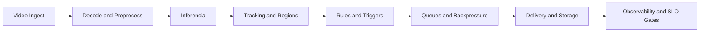

# Roadmap de Otimizacao (Precisao + Velocidade)

Este diretório consolida a estrategia de otimizacao para o runtime Frigate headless controlado por CMS, com foco em reduzir latencia, manter estabilidade e aumentar precisao de deteccao.

## Objetivo
Aplicar uma arquitetura operacional otimizada para deteccao em tempo real, com tuning orientado por metricas e gates objetivos de qualidade.

## Escopo
- Pipeline de captura/decode/preprocessamento.
- Inferencia e tracking.
- Regras de evento, regioes e sensibilidade.
- Filas, backpressure e entrega de eventos.
- Benchmark, SLO e operacao continua.

## Diagrama - visao geral da trilha de otimizacao

## Fases
- `phase-00-baseline-and-targets.md`
- `phase-01-video-ingest-and-decode-optimization.md`
- `phase-02-inference-and-model-tuning.md`
- `phase-03-tracking-and-region-strategy.md`
- `phase-04-event-rules-and-noise-reduction.md`
- `phase-05-queues-priority-and-backpressure.md`
- `phase-06-storage-and-event-delivery-efficiency.md`
- `phase-07-load-benchmark-and-slo-gates.md`
- `phase-08-operational-playbook-and-continuous-tuning.md`

## Sequencia de execucao
Eu vou executar as fases na ordem acima, medindo impacto por tenant/camera e bloqueando alteracoes sem evidencia de ganho.
