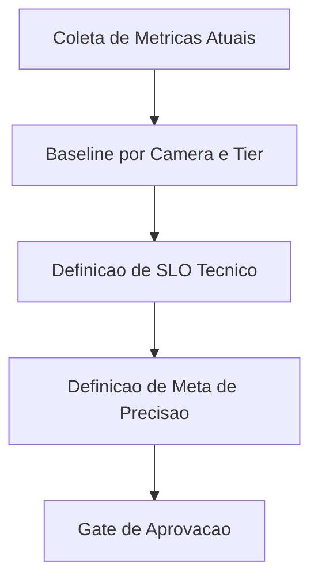

# Fase 00 - Baseline e Metas de Desempenho

## Objetivo da fase
Nesta fase eu estabeleco linha de base real do sistema e metas de precisao/velocidade para orientar todas as otimizacoes.

## Diagrama - baseline ate definicao de metas

## O que eu vou alterar
- Coletar baseline por perfil de camera (resolucao, fps, bitrate, cenario).
- Definir SLOs tecnicos:
  - `inference_latency_p95`
  - `queue_depth`
  - `drop_rate`
  - `event_delivery_latency`
- Definir metas de precisao:
  - falso positivo por classe
  - falso negativo por zona critica
- Separar metas por tier de hardware (edge basico, medio, robusto).

## Decisoes tecnicas tomadas
- Eu vou medir antes de otimizar para evitar tuning cego.
- Eu vou usar mesma carga de teste para comparar versoes.
- Eu vou tratar regressao de latencia e precisao como bloqueante.

## Criterios de aceite
- Baseline documentado por camera/tier.
- Metas de desempenho e precisao aprovadas.
- Painel minimo de metricas pronto.

## Impacto no sistema
Otimizacoes passam a ser guiadas por numeros objetivos.

## Proximos passos
Eu otimizo ingestao e decode na Fase 01.

## Implementacao aplicada
- Baseline por tier e perfil em `POST /v1/optimization/perf/baseline`.
- Metas tecnicas versionadas em `POST /v1/optimization/perf/targets`.
- Snapshot consolidado para operacao em `GET /v1/optimization/perf/status`.
