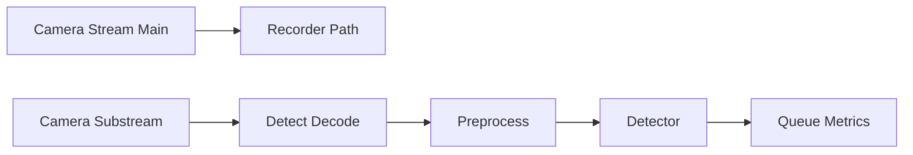

# Fase 01 - Otimizacao de Ingestao e Decode de Video

## Objetivo da fase
Nesta fase eu reduzo latencia e carga de CPU no caminho de entrada de video.

## Diagrama - pipeline de ingestao e decode

## O que eu vou alterar
- Padronizar uso de substream para deteccao.
- Ajustar FPS de deteccao por camera (3-5 como baseline).
- Reduzir resolucao de detect para o minimo eficaz por classe/cenario.
- Ativar aceleracao de decode por hardware quando disponivel.
- Revisar buffer de captura para evitar backlog oculto.

## Decisoes tecnicas tomadas
- Eu vou separar stream de detect e stream de gravacao.
- Eu vou preferir estabilidade de latencia a pico de qualidade visual.
- Eu vou evitar bitrate excessivo no caminho de detect.

## Criterios de aceite
- Queda de uso de CPU no decode.
- Reducao de `queue_depth` sob carga equivalente.
- Sem perda relevante de precisao na validacao.

## Impacto no sistema
A deteccao fica mais previsivel e leve sob carga.

## Proximos passos
Eu otimizo inferencia e modelo na Fase 02.

## Implementacao aplicada
- Configuracao de tuning de ingest/decode por tenant em `POST /v1/optimization/perf/ingest-decode`.
- Parametros de detect fps/resolucao e decode assistido armazenados com trilha temporal.
