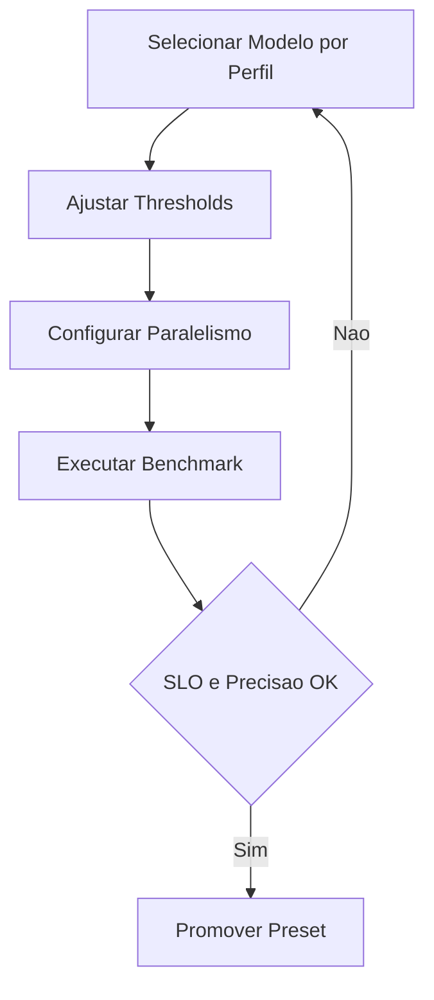

# Fase 02 - Tuning de Inferencia e Modelo

## Objetivo da fase
Nesta fase eu ajusto modelo, thresholds e paralelismo para aumentar throughput com precisao controlada.

## Diagrama - ciclo de tuning de inferencia

## O que eu vou alterar
- Selecionar modelo por perfil de camera/ambiente.
- Ajustar `min_confidence` por classe e por tenant.
- Regular batch/paralelismo conforme acelerador (GPU/TPU/NPU).
- Definir limites para prevenir saturacao continua de inferencia.
- Comparar custo x acuracia entre presets de modelo.

## Decisoes tecnicas tomadas
- Eu vou priorizar modelo com melhor relacao latencia/precisao por cenario.
- Eu vou separar tuning de dia/noite quando necessario.
- Eu vou manter fallback seguro para perfil conservador.

## Criterios de aceite
- Melhoria de `inference_latency_p95` sem aumento critico de falso positivo.
- Throughput sustentavel por no dentro da meta.
- Nenhuma saturacao prolongada do acelerador em carga normal.

## Impacto no sistema
O motor de deteccao ganha velocidade com qualidade consistente.

## Proximos passos
Eu refino tracking e estrategia de regioes na Fase 03.
