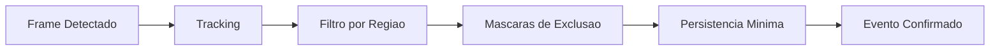

# Fase 03 - Tracking e Estrategia de Regioes

## Objetivo da fase
Nesta fase eu melhoro precisao percebida pelo operador reduzindo ruido com tuning de tracking e demarcacao inteligente.

## Diagrama - estrategia de regioes e tracking

## O que eu vou alterar
- Revisar geometria de regioes criticas por camera.
- Aplicar mascaras de exclusao em zonas de ruido recorrente.
- Ajustar persistencia minima para confirmacao de evento.
- Definir politicas por tipo de regiao (`inside`, `crossing`, `enter_exit`).
- Calibrar rastreamento para minimizar duplicidade de evento.

## Decisoes tecnicas tomadas
- Eu vou tratar regiao como filtro de negocio, nao apenas geometria.
- Eu vou separar presets indoor/outdoor.
- Eu vou versionar mudancas de regiao com auditoria no CMS.

## Criterios de aceite
- Reducao de falsos positivos em zonas tratadas.
- Menor duplicidade de disparo por objeto.
- Estabilidade de rastreamento em cenarios de movimento moderado.

## Impacto no sistema
A qualidade do evento melhora sem custo alto de processamento adicional.

## Proximos passos
Eu otimizo regras de evento e reducao de ruido na Fase 04.

## Implementacao aplicada
- Estrategia de tracking/regioes por tenant em `POST /v1/optimization/perf/tracking-regions`.
- Ajustes de mascara/persistencia e revisao incremental orientada por perfil operacional.
