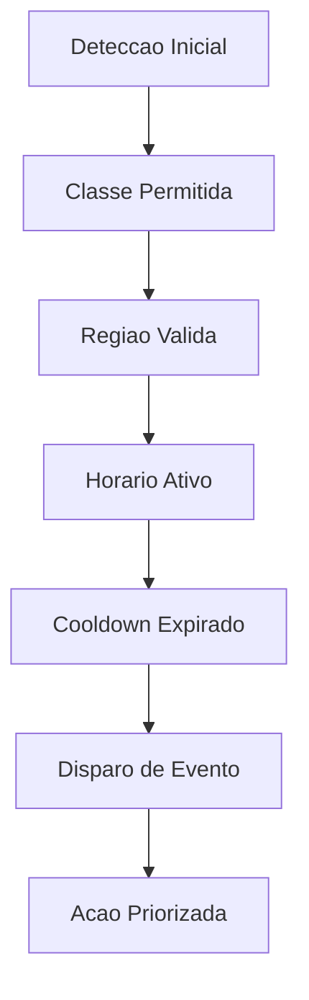

# Fase 04 - Regras de Evento e Reducao de Ruido

## Objetivo da fase
Nesta fase eu aumento precisao operacional ajustando regras de evento para gerar alerta util e acionavel.

## Diagrama - decisao de regra de evento

## O que eu vou alterar
- Definir cooldown por classe/regra para evitar spam.
- Aplicar janelas de horario por contexto operacional.
- Implementar regras compostas (classe + regiao + horario).
- Priorizar eventos criticos e degradar nao criticos sob carga.
- Ajustar sensibilidade por camera/regiao via CMS.

## Decisoes tecnicas tomadas
- Eu vou priorizar qualidade de alerta sobre volume bruto de evento.
- Eu vou separar regras de seguranca critica de regras informativas.
- Eu vou usar historico de ruido para recalibrar thresholds.

## Criterios de aceite
- Reducao de alertas irrelevantes por camera.
- Melhoria da taxa de acerto percebida pelo operador.
- Sem regressao de deteccao em zonas criticas.

## Impacto no sistema
Eventos se tornam mais confiaveis para automacao e resposta humana.

## Proximos passos
Eu trato filas e backpressure na Fase 05.
