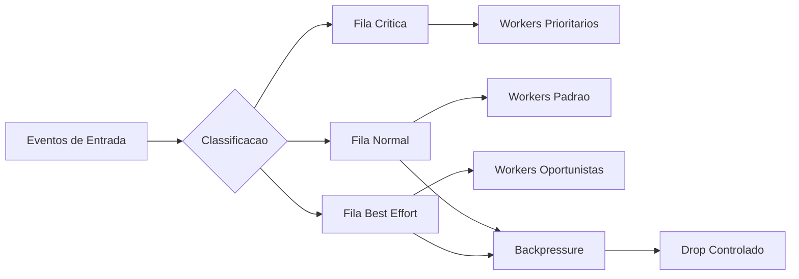

# Fase 05 - Filas, Prioridade e Backpressure

## Objetivo da fase
Nesta fase eu evito atrasos em cascata aplicando controle explicito de fila e prioridade.

## Diagrama - filas por prioridade e backpressure

## O que eu vou alterar
- Separar filas por prioridade (critico, normal, best-effort).
- Definir limites por fila (`max_queue`) e politicas de descarte controlado.
- Aplicar backpressure antes de saturacao total.
- Expor metricas de lag e tempo em fila por tipo de evento.
- Isolar caminhos de entrega para nao bloquear pipeline principal.

## Decisoes tecnicas tomadas
- Eu vou proteger eventos criticos com prioridade absoluta.
- Eu vou preferir descarte controlado de baixa prioridade a travamento global.
- Eu vou manter idempotencia para retries seguros.

## Criterios de aceite
- Ausencia de crescimento infinito de fila em pico.
- Latencia de eventos criticos dentro do SLO.
- Recuperacao rapida apos burst.

## Impacto no sistema
A operacao fica resiliente em carga alta sem colapsar fluxo principal.

## Proximos passos
Eu otimizo eficiencia de storage e entrega de evento na Fase 06.
