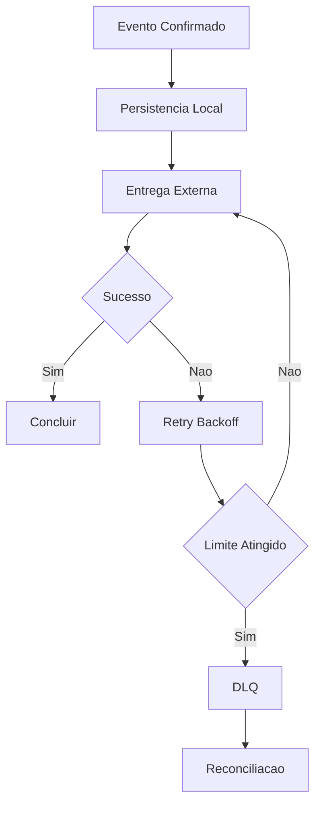

# Fase 06 - Eficiencia de Storage e Entrega de Eventos

## Objetivo da fase
Nesta fase eu reduzo custo e latencia no caminho de persistencia e distribuicao de eventos.

## Diagrama - entrega confiavel com retry e DLQ

## O que eu vou alterar
- Aplicar estrategia local-first com replicacao assincrona de midia.
- Otimizar formato/tamanho de artefatos para envio.
- Ajustar retries com backoff/jitter e DLQ por destino.
- Implementar reconciliacao de pendencias de entrega.
- Definir TTL e retencao por criticidade de evento.

## Decisoes tecnicas tomadas
- Eu vou evitar bloquear deteccao por indisponibilidade externa.
- Eu vou separar persistencia transacional de pipeline de midia.
- Eu vou rastrear falha por destino com visibilidade operacional.

## Criterios de aceite
- Sem perda silenciosa de evento critico.
- Backlog de entrega sob controle em condicoes normais.
- Recuperacao previsivel apos falha de rede temporaria.

## Impacto no sistema
Entrega externa fica mais confiavel com menor impacto no motor de deteccao.

## Proximos passos
Eu valido carga e gates objetivos na Fase 07.

## Implementacao aplicada
- Parametros de eficiencia de entrega/storage em `POST /v1/optimization/perf/delivery-efficiency`.
- Backlog e DLQ operacional acompanhados no snapshot de status do engine de otimizacao.
