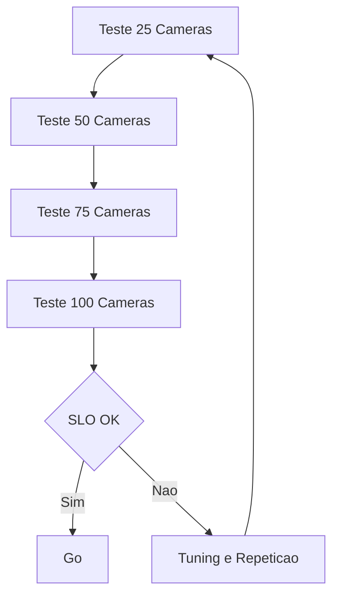

# Fase 07 - Benchmark de Carga e Gates de SLO

## Objetivo da fase
Nesta fase eu valido a arquitetura otimizada sob carga realista e formalizo gates de promocao.

## Diagrama - benchmark progressivo e gate go/no-go

## O que eu vou alterar
- Executar benchmark progressivo (25 -> 50 -> 75 -> 100 cameras).
- Rodar cenarios de caos (restart, rede intermitente, storage lento).
- Medir p95/p99 de inferencia e entrega de evento.
- Validar estabilidade de fila e taxa de drop.
- Definir go/no-go por ambiente.

## Decisoes tecnicas tomadas
- Eu vou comparar sempre contra baseline congelado.
- Eu vou reprovar release com degradacao acima do limite.
- Eu vou manter evidencia reproduzivel por teste.

## Criterios de aceite
- SLOs cumpridos no alvo de cameras por no.
- Recuperacao dentro do MTTR definido apos falha induzida.
- Sem regressao de precisao acima do limite tolerado.

## Impacto no sistema
Confianca de producao passa a ser sustentada por evidencia, nao percepcao.

## Proximos passos
Eu formalizo playbooks e tuning continuo na Fase 08.
