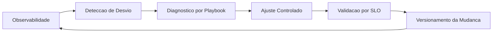

# Fase 08 - Playbook Operacional e Tuning Continuo

## Objetivo da fase
Nesta fase eu transformo otimizacao em rotina operacional para manter desempenho e precisao ao longo do tempo.

## Diagrama - ciclo continuo de tuning operacional

## O que eu vou alterar
- Criar playbook de tuning por sintoma:
  - latencia alta
  - fila crescente
  - falso positivo alto
  - perda de evento
- Definir rotina de recalibracao por tipo de ambiente (indoor/outdoor).
- Implementar revisao periodica de regioes e regras por tenant.
- Automatizar relatorios semanais de performance/precisao.
- Vincular incidentes a acoes corretivas versionadas.

## Decisoes tecnicas tomadas
- Eu vou tratar tuning como ciclo continuo, nao projeto pontual.
- Eu vou priorizar mudancas pequenas e mensuraveis.
- Eu vou manter historico de configuracao e impacto observado.

## Criterios de aceite
- Operacao consegue diagnosticar e corrigir degradacao com playbook.
- Regressao detectada cedo por alertas e scorecards.
- Ganhos de desempenho sustentados apos atualizacoes.

## Impacto no sistema
A arquitetura permanece rapida e precisa mesmo com crescimento de carga e diversidade de cenarios.

## Proximos passos
Eu reciclo o ciclo iniciando nova baseline apos cada release maior.
